# 掌柜智库 - 流程设计文档

> 本文档基于 `RAG项目架构分析报告.md`、`教案` 和 `掌柜智库-功能优化需求文档.md`，对现有系统流程和优化需求的流程设计进行详细说明。

---

## 目录

- [一、系统架构总览](#一系统架构总览)
- [二、现有流程设计](#二现有流程设计)
- [三、优化需求流程设计](#三优化需求流程设计)
- [四、状态定义变更汇总](#四状态定义变更汇总)

---

## 一、系统架构总览

### 1.1 分层架构

```mermaid
flowchart TB
    subgraph Frontend["前端层"]
        direction LR
        F1["chat.html<br/>查询交互页面<br/>port 8001"]
        F2["import.html<br/>文件导入页面<br/>port 8000"]
        F3["login.html<br/>登录页面<br/>port 8002"]
    end

    subgraph API["API 服务层 (FastAPI)"]
        direction LR
        A1["query_server.py<br/>查询服务"]
        A2["import_server.py<br/>导入服务"]
        A3["auth_server.py<br/>认证服务"]
    end

    subgraph Process["流程编排层 (LangGraph)"]
        direction LR
        P1["Query Graph<br/>7 节点检索流程"]
        P2["Import Graph<br/>7 节点导入流程"]
    end

    subgraph RAG["业务逻辑层"]
        direction LR
        R1["rag/query/<br/>7 个 query service"]
        R2["rag/import_/<br/>7 个 import service"]
    end

    subgraph Infra["基础设施层"]
        direction LR
        I1["Milvus<br/>向量数据库"]
        I2["MongoDB<br/>文档数据库"]
        I3["MinIO<br/>对象存储"]
        I4["LLM<br/>Qwen-Flash"]
        I5["BGE-M3<br/>Embedding"]
        I6["BGE-Reranker<br/>重排序"]
        I7["MinerU<br/>PDF 解析"]
        I8["MCP<br/>百炼 WebSearch"]
    end

    Frontend --> API
    API --> Process
    Process --> RAG
    RAG --> Infra
```

### 1.2 服务端口与职责

| 服务 | 端口 | 职责 | 入口文件 |
|------|------|------|----------|
| 导入服务 | 8000 | 文件上传、导入执行、状态查询 | `app/api/http/import_server.py` |
| 查询服务 | 8001 | 问题查询、SSE 流式输出、历史管理 | `app/api/http/query_server.py` |
| 认证服务 | 8002 | 登录注册、JWT Token 管理 | `app/api/http/auth_server.py` |

---

## 二、现有流程设计

### 2.1 导入流程（Import Pipeline）

#### 2.1.1 流程总览

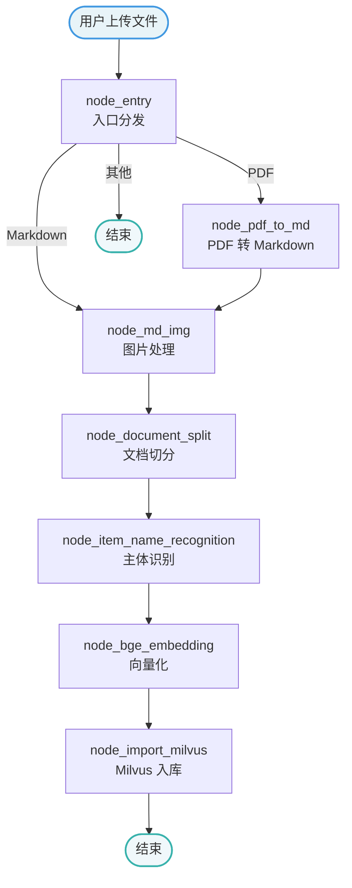

#### 2.1.2 节点详细说明

| 节点 | 输入 State | 输出 State | 核心逻辑 |
|------|-----------|-----------|----------|
| `node_entry` | `local_file_path`, `task_id` | `is_pdf_read_enabled`, `is_md_read_enabled`, `pdf_path`, `md_path`, `file_title` | 识别文件类型，设置路由标识 |
| `node_pdf_to_md` | `pdf_path`, `local_dir` | `md_path`, `md_content` | 调用 MinerU 解析 PDF，下载解压结果 |
| `node_md_img` | `md_path`, `md_content` | `md_content`（替换图片 URL） | 扫描图片引用，视觉模型生成描述，上传 MinIO |
| `node_document_split` | `md_content`, `file_title` | `chunks` | 标题粗切 → 超长细切 → 超短合并 |
| `node_item_name_recognition` | `chunks`, `file_title` | `item_name`, `chunks`（回填） | LLM 识别文档主体，兜底用 file_title |
| `node_bge_embedding` | `chunks` | `chunks`（含 dense/sparse vector） | BGE-M3 批量生成混合向量 |
| `node_import_milvus` | `chunks` | `chunks`（含 chunk_id） | 幂等删除旧数据 → 批量插入 Milvus |

#### 2.1.3 数据流转图

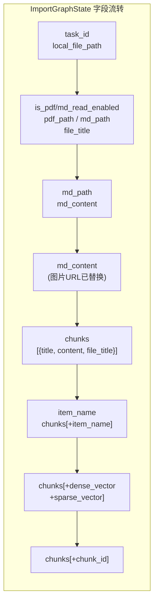

#### 2.1.4 Milvus 双层索引设计

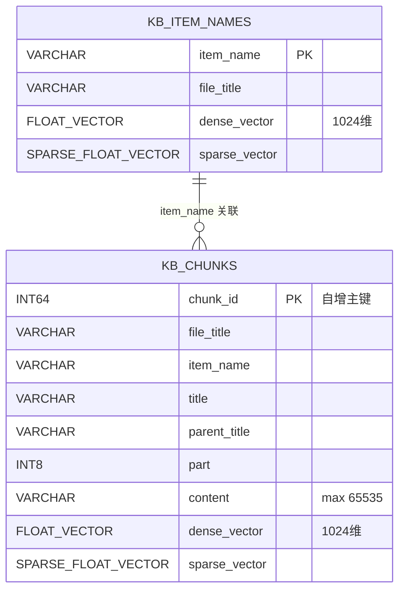

---

### 2.2 检索流程（Query Pipeline）

#### 2.2.1 流程总览

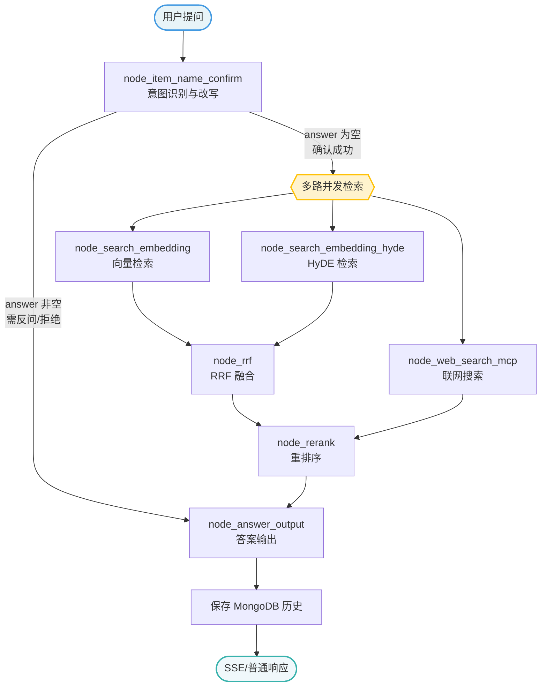

#### 2.2.2 节点详细说明

| 节点 | 输入 State | 输出 State | 核心逻辑 |
|------|-----------|-----------|----------|
| `node_item_name_confirm` | `original_query`, `session_id` | `item_names`, `rewritten_query`, `answer`(可选), `history` | 历史读取 → LLM 识别主体+改写 → Milvus 验证 → 分级处理 |
| `node_search_embedding` | `rewritten_query`, `item_names` | `embedding_chunks` | BGE-M3 混合检索，dense(0.4)+sparse(0.6) 加权 |
| `node_search_embedding_hyde` | `rewritten_query`, `item_names` | `hyde_embedding_chunks` | LLM 生成假设答案 → 对答案向量检索 |
| `node_web_search_mcp` | `rewritten_query` | `web_search_docs` | MCP 协议调用百炼 WebSearch |
| `node_rrf` | `embedding_chunks`, `hyde_embedding_chunks` | `rrf_chunks` | RRF 排名融合，k=60 |
| `node_rerank` | `rrf_chunks`, `web_search_docs`, `rewritten_query` | `reranked_docs` | BGE-Reranker 精排 + 动态断崖截断 |
| `node_answer_output` | `reranked_docs`, `rewritten_query`, `history`, `item_names` | `answer`, `image_urls` | Prompt 组装 → LLM 生成 → SSE 流式 → 保存历史 |

#### 2.2.3 条件边逻辑

`node_item_name_confirm` 之后的路由判断:

```python
def node_item_name_confirm_after(state):
    if state.get('answer'):
        # answer 非空: 反问/拒绝/可选项提示 → 直接到输出节点
        return 'node_answer_output'
    # answer 为空: 主体确认成功 → 并发执行三路检索
    return 'node_search_embedding', 'node_search_embedding_hyde', 'node_web_search_mcp'
```

#### 2.2.4 主体确认分级策略

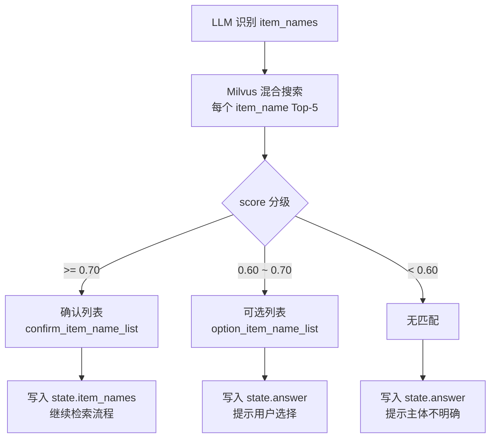

#### 2.2.5 多路检索与融合排序

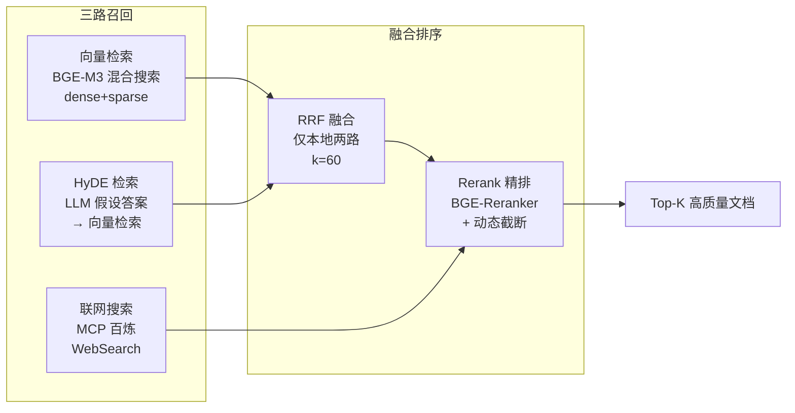

---

### 2.3 认证流程（Auth Pipeline）

#### 2.3.1 流程总览

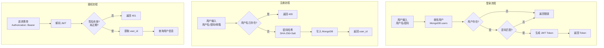

---

## 三、优化需求流程设计

### REQ-01: item_name 可选项前端交互优化

#### 3.1.1 流程变更

**当前流程:**

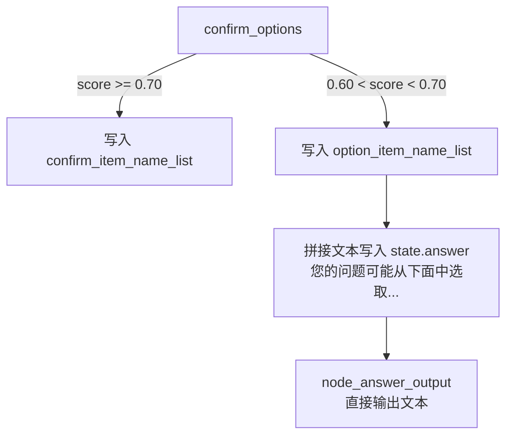

**优化后流程:**

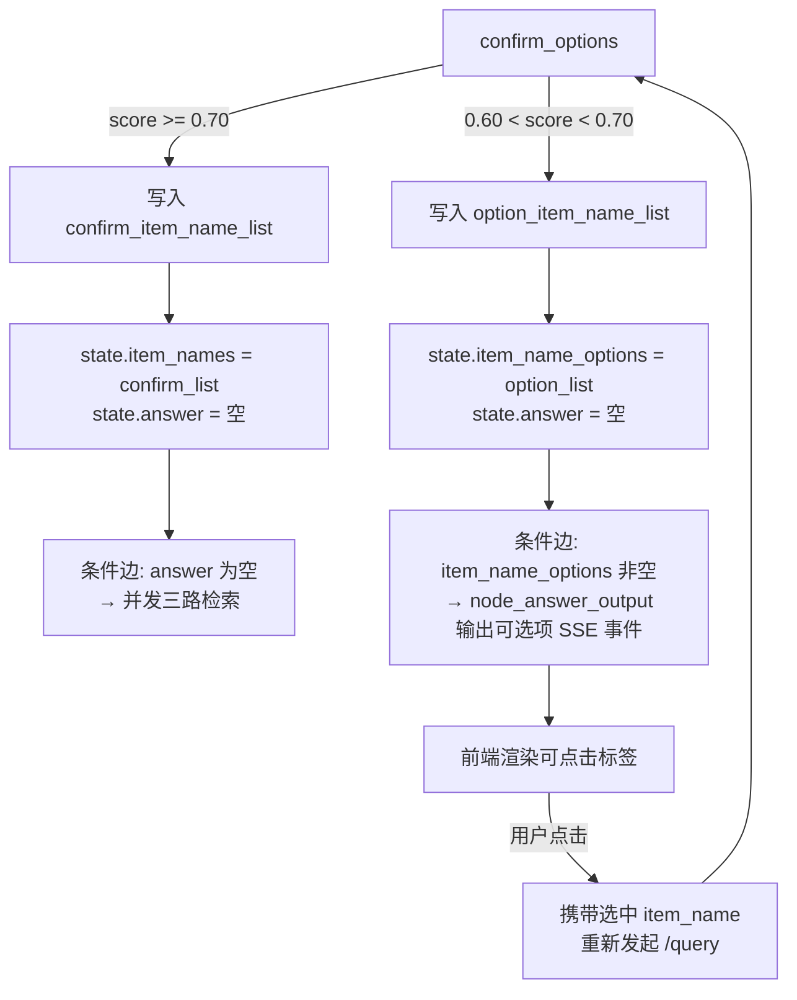

#### 3.1.2 State 变更

```python
class QueryGraphState(TypedDict):
    # ... 原有字段 ...
    item_name_options: list[str]  # 新增: 可选主体列表 (0.60-0.70)
```

#### 3.1.3 条件边变更

```python
def node_item_name_confirm_after(state: QueryGraphState):
    # 新增分支: 有可选项时走输出节点展示可选项
    if state.get('item_name_options'):
        return 'node_answer_output'
    # 原有逻辑
    if state.get('answer'):
        return 'node_answer_output'
    return 'node_search_embedding', 'node_search_embedding_hyde', 'node_web_search_mcp'
```

#### 3.1.4 SSE 事件扩展

新增事件类型 `ITEM_OPTIONS`:

```python
class SSEEvent:
    # ... 原有事件 ...
    ITEM_OPTIONS = "item_options"  # 新增

# 推送格式
push_to_session(session_id, SSEEvent.ITEM_OPTIONS, {
    "options": ["华为P60 Max", "华为P60 Pro"],
    "message": "您的问题可能涉及以下产品，请选择："
})
```

#### 3.1.5 前端交互流程

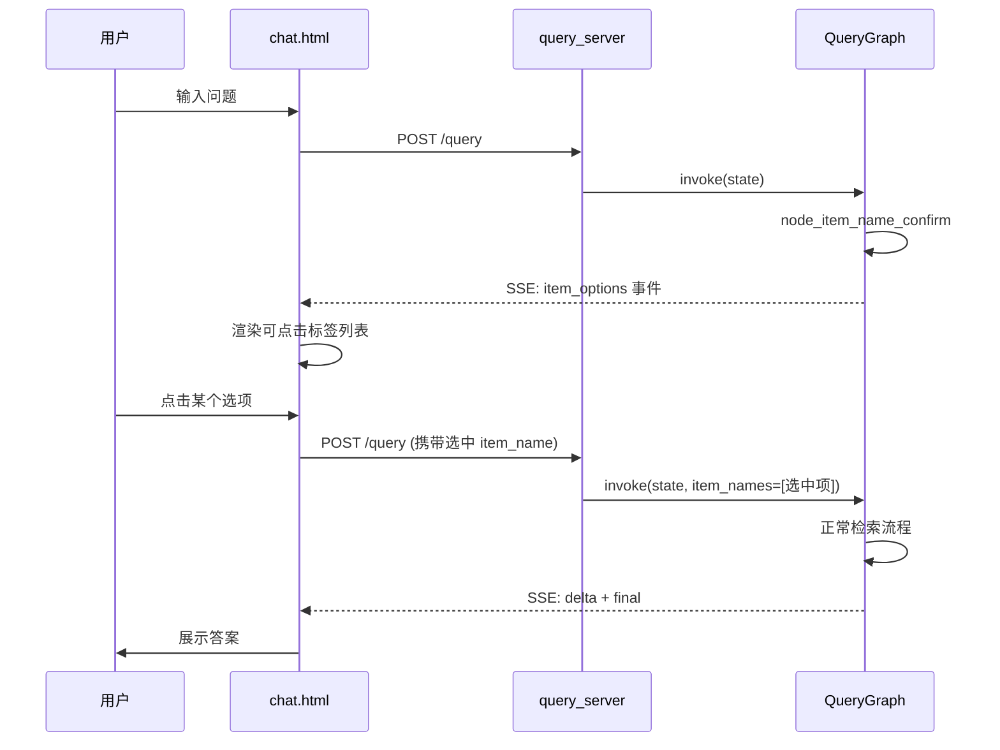

---

### REQ-04: 登录页面 + 白名单权限控制

#### 3.4.1 整体认证流程

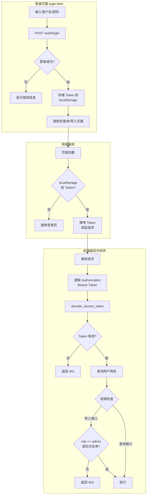

#### 3.4.2 用户角色模型

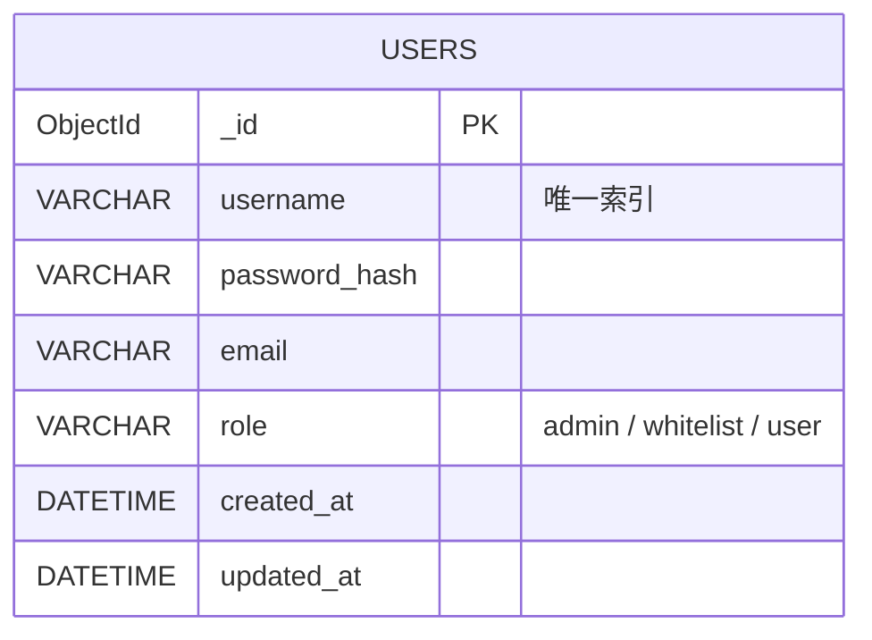

角色权限矩阵:

| 接口 | user | whitelist | admin |
|------|------|-----------|-------|
| POST /query | Y | Y | Y |
| GET /history | Y | Y | Y |
| POST /upload | N | Y | Y |
| GET /auth/me | Y | Y | Y |

#### 3.4.3 导入服务鉴权中间件

```python
# import_server.py 中新增依赖
from app.shared.utils.auth_utils import decode_access_token
from app.shared.clients.mongo_user_utils import find_user_by_id

def verify_import_permission(authorization: str):
    """校验导入权限: Token 有效 + 角色为 admin 或 whitelist"""
    if not authorization or not authorization.startswith("Bearer "):
        raise HTTPException(status_code=401, detail="未提供认证凭证")
    token = authorization.replace("Bearer ", "")
    payload = decode_access_token(token)
    if payload is None:
        raise HTTPException(status_code=401, detail="Token 无效或已过期")
    user = find_user_by_id(payload.get("sub"))
    if user is None:
        raise HTTPException(status_code=401, detail="用户不存在")
    if user.get("role") not in ("admin", "whitelist"):
        raise HTTPException(status_code=403, detail="无导入权限")
    return user
```

---

### REQ-05: 导入进度百分比与进度条

#### 3.5.1 节点权重定义

```python
NODE_WEIGHTS = {
    "node_entry": 5,
    "node_pdf_to_md": 25,
    "node_md_img": 15,
    "node_document_split": 10,
    "node_item_name_recognition": 15,
    "node_bge_embedding": 20,
    "node_import_milvus": 10,
}
```

#### 3.5.2 进度计算流程

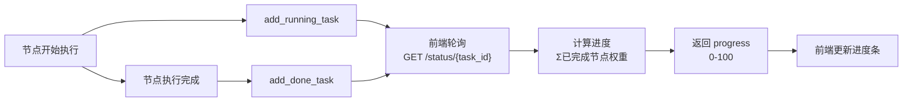

#### 3.5.3 接口响应变更

```python
# import_schema.py
class TaskStatusSchema(BaseModel):
    code: int
    task_id: str
    status: str
    done_list: list[str]
    running_list: list[str]
    progress: float  # 新增: 0-100 百分比
```

---

### REQ-06: 文档更新哈希校验

#### 3.6.1 校验流程

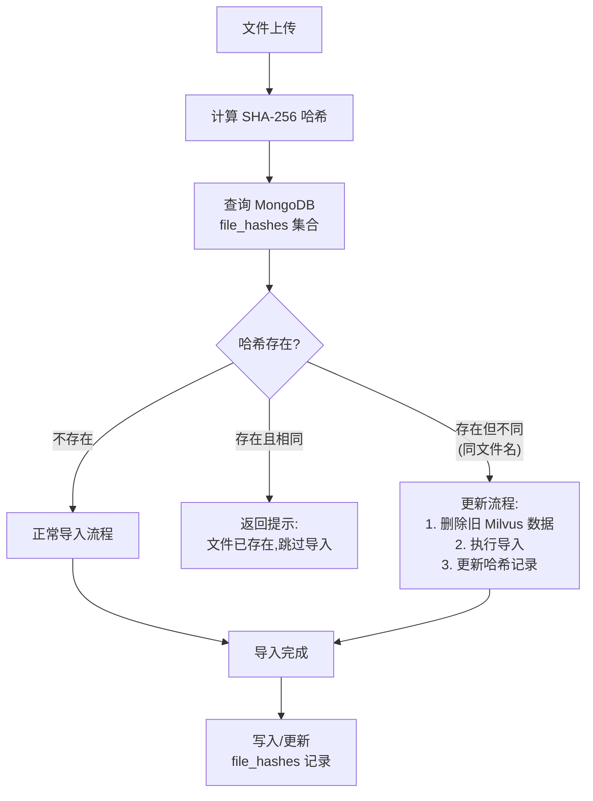

#### 3.6.2 MongoDB 集合设计

```json
// file_hashes 集合
{
    "_id": ObjectId,
    "file_name": "华为P60产品手册.pdf",
    "file_hash": "a1b2c3d4e5f6...",
    "item_name": "华为P60",
    "task_id": "uuid-xxx",
    "import_time": ISODate("2026-06-12T10:00:00Z"),
    "file_size": 1024000
}
```

#### 3.6.3 node_entry 节点改造

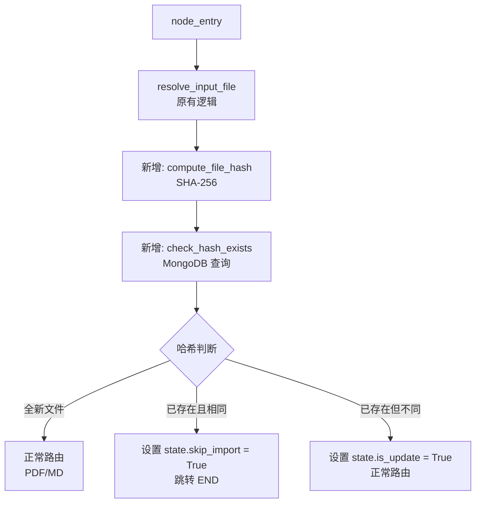

---

### REQ-07: 历史记录存储优化

#### 3.7.1 用户维度关联

```mermaid
flowchart TD
    A["用户登录"] --> B["获取 user_id"]
    B --> C["查询历史时<br/>按 user_id 过滤"]
    C --> D["返回该用户<br/>所有会话历史"]

    subgraph HistoryRecord["历史记录结构"]
        H1["session_id"]
        H2["user_id"]  %% 新增
        H3["role"]
        H4["text"]
        H5["rewritten_query"]
        H6["item_names"]
        H7["image_urls"]
        H8["ts"]
    end
```

#### 3.7.2 新增接口

| 接口 | 方法 | 说明 |
|------|------|------|
| `/sessions/{user_id}` | GET | 返回用户会话列表（去重 session_id + 最后活跃时间） |
| `/history/user/{user_id}` | GET | 返回用户所有会话的历史记录 |
| `/history/{session_id}` | DELETE | 清空指定会话历史（已有） |

---

### REQ-09: 历史记录滞后校验

#### 3.9.1 滞后判断流程

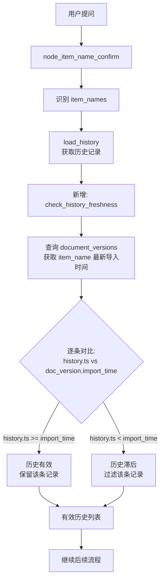

#### 3.9.2 MongoDB 集合设计

```json
// document_versions 集合
{
    "_id": ObjectId,
    "item_name": "华为P60",
    "file_name": "华为P60产品手册.pdf",
    "file_hash": "a1b2c3d4...",
    "last_import_time": ISODate("2026-06-12T10:00:00Z"),
    "task_id": "uuid-xxx"
}
```

#### 3.9.3 与 REQ-08 的协同

当 REQ-08（历史语义相似度匹配）和 REQ-09 同时生效时:

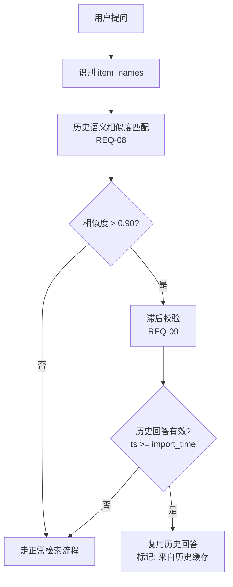

---

### REQ-10: 多格式文件上传支持

#### 3.10.1 格式路由扩展

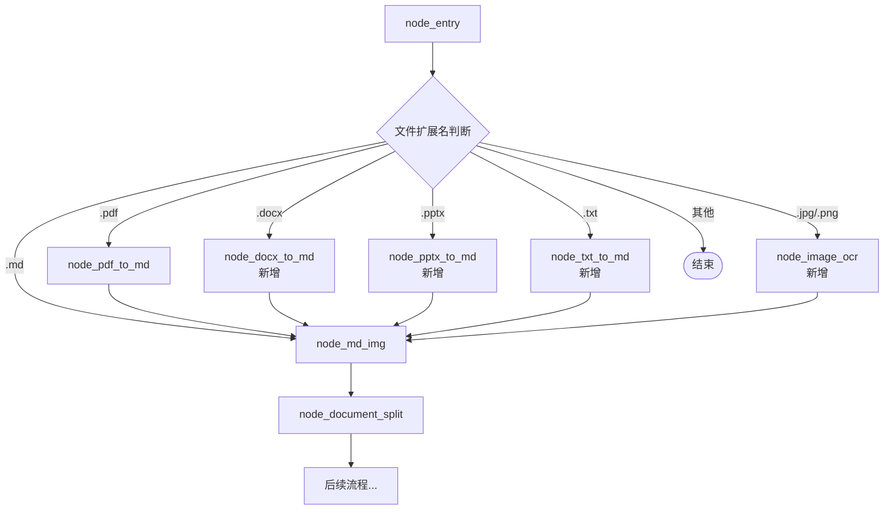

#### 3.10.2 State 变更

```python
class ImportGraphState(TypedDict):
    # ... 原有字段 ...
    file_type: str  # 新增: "pdf" / "md" / "docx" / "pptx" / "txt" / "image"
```

#### 3.10.3 条件边改造

```python
def after_entry_node(state: ImportGraphState):
    file_type = state.get("file_type", "")
    route_map = {
        "pdf": "node_pdf_to_md",
        "md": "node_md_img",
        "docx": "node_docx_to_md",
        "pptx": "node_pptx_to_md",
        "txt": "node_txt_to_md",
        "image": "node_image_ocr",
    }
    return route_map.get(file_type, END)
```

---

### REQ-11: 多文件同时上传

#### 3.11.1 批量上传流程

```mermaid
flowchart TD
    A["前端选择多个文件"] --> B["循环调用 POST /upload<br/>每个文件独立请求"]
    B --> C["后端每个文件<br/>生成独立 task_id"]
    C --> D["并行执行 BackgroundTasks"]
    D --> E["前端为每个文件<br/>独立轮询状态"]

    subgraph BatchUI["前端批量展示"]
        F1["文件1: 进度条 + 状态"]
        F2["文件2: 进度条 + 状态"]
        F3["文件N: 进度条 + 状态"]
    end

    E --> BatchUI
```

#### 3.11.2 前端改造

`import.html` 中 `handleFiles` 改造:

```javascript
async function handleFiles(files) {
    // 并行上传所有文件
    const uploadPromises = Array.from(files).map(file => uploadFile(file));
    await Promise.allSettled(uploadPromises);
    // 每个文件独立创建 UI 和轮询
}
```

---

### REQ-12: 无主体时网络检索 + 前端提示

#### 3.12.1 流程变更

**当前流程 (无主体时):**

```mermaid
flowchart TD
    A["confirm_options"] -->|"confirm 和 option<br/>都为空"| B["state.answer = '主体不明确'"]
    B --> C["node_answer_output<br/>输出拒绝文本"]
```

**优化后流程:**

```mermaid
flowchart TD
    A["confirm_options"] -->|"confirm 和 option<br/>都为空"| B["设置 state.is_web_only = True<br/>state.item_names = [rewritten_query]"]
    B --> C{"条件边判断"}
    C -->|"is_web_only = True"| D["仅执行<br/>node_web_search_mcp"]
    C -->|"is_web_only = False"| E["原有三路并发"]

    D --> F["node_rerank"]
    F --> G["node_answer_output"]
    G --> H["答案前缀:<br/>该问题不在知识库中,<br/>以下是网络搜索结果:"]
    H --> I["SSE 输出"]
```

#### 3.12.2 State 变更

```python
class QueryGraphState(TypedDict):
    # ... 原有字段 ...
    is_web_only: bool  # 新增: 是否仅走网络检索
```

#### 3.12.3 条件边变更

```python
def node_item_name_confirm_after(state: QueryGraphState):
    if state.get('item_name_options'):
        return 'node_answer_output'
    if state.get('answer'):
        return 'node_answer_output'
    # 新增: 纯网络检索模式
    if state.get('is_web_only'):
        return 'node_web_search_mcp'
    return 'node_search_embedding', 'node_search_embedding_hyde', 'node_web_search_mcp'
```

条件边映射表新增:

```python
{
    'node_web_search_mcp': 'node_web_search_mcp',  # 新增路由
    # ... 原有映射 ...
}
```

#### 3.12.4 node_rrf 适配

当 `is_web_only = True` 时，`embedding_chunks` 和 `hyde_embedding_chunks` 为空，RRF 节点应跳过:

```python
def fuse_by_rrf(state: QueryGraphState) -> QueryGraphState:
    if state.get('is_web_only'):
        state['rrf_chunks'] = []
        return state
    # 原有 RRF 逻辑
```

---

### REQ-13: 公式/特殊内容切片策略

#### 3.13.1 切片流程增强

```mermaid
flowchart TD
    A["原始 Markdown"] --> B["预处理阶段"]
    B --> B1["识别 LaTeX 公式<br/>$...$ / $$...$$"]
    B --> B2["识别代码块<br/>``` ... ```"]
    B --> B3["识别表格<br/>| ... | ... |"]

    B1 --> C["标记不可分割边界"]
    B2 --> C
    B3 --> C

    C --> D["标题级粗切<br/>(跳过标记区域)"]
    D --> E["超长细切<br/>(RecursiveCharacterTextSplitter<br/>分隔符增加公式边界)"]
    E --> F["超短合并"]
    F --> G["后处理: 恢复标记区域"]
```

#### 3.13.2 分隔符扩展

```python
separators = [
    "\n\n",     # 段落
    "\n",       # 换行
    "。",       # 句号
    "！",       # 感叹号
    "？",       # 问号
    "$$",       # LaTeX 块级公式边界
    "\n|",      # 表格行边界
]
```

---

### REQ-15: 多格式分流处理节点

#### 3.15.1 可插拔路由架构

```mermaid
flowchart TD
    A["node_entry"] --> B["识别 file_type"]
    B --> C{"路由注册表<br/>file_type → handler"}

    C -->|"pdf"| D1["node_pdf_to_md"]
    C -->|"md"| D2["node_md_img"]
    C -->|"docx"| D3["node_docx_to_md"]
    C -->|"pptx"| D4["node_pptx_to_md"]
    C -->|"txt"| D5["node_txt_to_md"]
    C -->|"image"| D6["node_image_ocr"]
    C -->|"未知"| END([END])

    D1 --> E["统一输出:<br/>md_content + md_path"]
    D2 --> E
    D3 --> E
    D4 --> E
    D5 --> E
    D6 --> E

    E --> F["node_document_split"]
    F --> G["后续通用流程..."]
```

#### 3.15.2 格式处理器注册表

```python
# main_graph.py
FORMAT_HANDLER_MAP = {
    "pdf": "node_pdf_to_md",
    "md": "node_md_img",
    "docx": "node_docx_to_md",
    "pptx": "node_pptx_to_md",
    "txt": "node_txt_to_md",
    "image": "node_image_ocr",
}

def after_entry_node(state: ImportGraphState):
    file_type = state.get("file_type", "")
    handler = FORMAT_HANDLER_MAP.get(file_type)
    if handler:
        return handler
    logger.warning(f"不支持的文件格式: {file_type}")
    return END
```

---

## 四、状态定义变更汇总

### 4.1 ImportGraphState 变更

```python
class ImportGraphState(TypedDict):
    # ========== 原有字段 ==========
    task_id: str
    is_md_read_enabled: bool
    is_pdf_read_enabled: bool
    local_file_path: str
    local_dir: str
    md_path: str
    pdf_path: str
    file_title: str
    md_content: str
    item_name: str
    chunks: list
    embeddings: list

    # ========== 新增字段 ==========
    file_type: str           # REQ-10/15: 文件类型标识
    skip_import: bool        # REQ-06: 哈希校验跳过标记
    is_update: bool          # REQ-06: 是否为更新导入
    file_hash: str           # REQ-06: 文件 SHA-256 哈希
```

### 4.2 QueryGraphState 变更

```python
class QueryGraphState(TypedDict):
    # ========== 原有字段 ==========
    session_id: str
    original_query: str
    embedding_chunks: list
    hyde_embedding_chunks: list
    web_search_docs: list
    rrf_chunks: list
    reranked_docs: list
    answer: str
    item_names: list[str]
    rewritten_query: str
    history: list
    is_stream: bool
    image_urls: list[str]

    # ========== 新增字段 ==========
    item_name_options: list[str]  # REQ-01: 可选主体列表
    is_web_only: bool             # REQ-12: 仅网络检索标记
    user_id: str                  # REQ-07: 用户 ID
    search_mode: str              # REQ-12: 检索模式 "normal" / "web_only"
```

---

## 附录: 优化需求与节点映射表

| 需求 | 涉及图 | 新增/修改节点 | 新增/修改 Service |
|------|--------|--------------|-------------------|
| REQ-01 | Query | 修改 `node_item_name_confirm` | 修改 `item_name_confirm_service` |
| REQ-02 | Import | 修改 `node_md_img` | 修改 `enrich_markdown_images` |
| REQ-03 | 通用 | 新增安全工具模块 | 修改各 prompt 模板 |
| REQ-04 | Auth | 无新增节点 | 修改各 server 中间件 |
| REQ-05 | Import | 无新增节点 | 修改 `task_utils` |
| REQ-06 | Import | 修改 `node_entry` | 新增 `mongo_file_hash_utils` |
| REQ-07 | Query | 无新增节点 | 修改 `history_repository` |
| REQ-08 | Query | 修改 `node_item_name_confirm` | 修改 `item_name_confirm_service` |
| REQ-09 | Query | 修改 `node_item_name_confirm` | 新增 `mongo_document_version_utils` |
| REQ-10 | Import | 新增 4 个格式处理节点 | 新增 4 个 parse service |
| REQ-11 | Import | 无新增节点 | 修改 `import_server` |
| REQ-12 | Query | 无新增节点 | 修改 `item_name_confirm_service` |
| REQ-13 | Import | 修改 `node_document_split` | 修改 `split_service` |
| REQ-14 | Import | 修改 `node_md_img` | 修改 `enrich_markdown_images` |
| REQ-15 | Import | 修改 `node_entry` + 条件边 | 无新增 |
